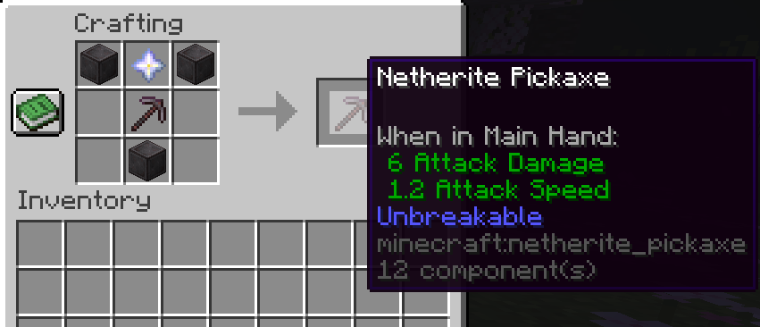

<h1 id="topBanner"align="center">
    
</h1>

    [GitHub Release][release]&nbsp;&nbsp;&nbsp;|&nbsp;&nbsp;&nbsp;[Screenshots](#screenshots)&nbsp;&nbsp;&nbsp;|&nbsp;&nbsp;&nbsp;[Issues][issues]

<h1>God Tier Pickaxe</h1>
Datapack for Minecraft 1.21! Lets you craft an unbreakable netherite pickaxe able to instantly mine deepslate when completely enchanted. Extremely good for farming materials. 
 
To craft the God Tier Pickaxe you will need 3 Blocks of Netherite, 1 Netherite Pickaxe and 1 Nether Star.

<h2 id="screenshots">Screenshots</h2>

<h3>Crafting Recipe</h3>

<h3>God Tier Pickaxe working</h3>

[release]:https://github.com/ChillCraftDevelopment/GodTierPickaxe/releases/latest "Latest Release (external link)"
[issues]:https://github.com/ChillCraftDevelopment/GodTierPickaxe/issues "Issues (external link)"